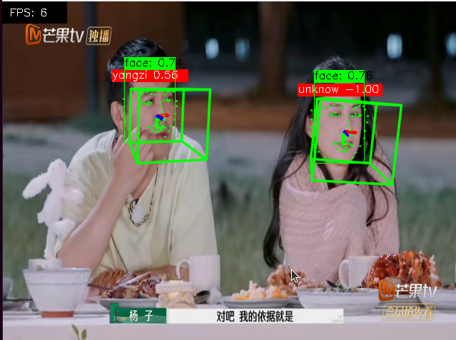

# Mobile_Face_Process

轻量化人脸相关数据处理的onnx模型，用于人脸检测、关键点识别、人脸识别

人脸处理相关模型[下载](https://drive.google.com/drive/folders/16emdBvVrLwdtlSBoGwWqxLIIdpebPDGW?usp=drive_link)

下载完成后，将模型放置到 assert/ 文件夹下 
~~~
demo.mov
assert 
├── face_detector.onnx
├── face_landmarks.onnx
├── vggface_quantized.onnx
├── facenet128.onnx
└── facial_expression.onnx
~~~

人脸数据库在face_dataset/文件夹下

在RK3588上进行调用[请查看](https://github.com/Tianlei0702/mobile_face_process/tree/main/RKNN)

通过人脸检测 —— 人脸识别（默认facenet128的模型）—— 人脸表情识别 —— 人脸关键点识别 —— 关键点生成人脸朝向
## Install
~~~
conda remove -n face_onnx --all
conda create -n face_onnx python=3.8
conda activate face_onnx
pip install -r requirement.txt
~~~

## Running
重新加载人脸数据库, demo.mov 放在运行目录下
~~~
# 第一次使用要加载人脸库 --facedb
python main_onnx.py --video demo.mov --facedb  
~~~

不加载人脸数据库
~~~
python main_onnx.py --video demo.mov
~~~

## Limitation
目前，人脸识别用的deepface中的VGGFace和FaceNet,转到onnx后在cpu上的推理速度依旧比较慢。
暂时采取的策略是第一次检测到人脸数量变化，进行人脸识别，或正常情况下 人脸识别50帧/次

## Citation
[deepface](https://github.com/serengil/deepface)
[head-pose-estimation](https://github.com/yinguobing/head-pose-estimation)

